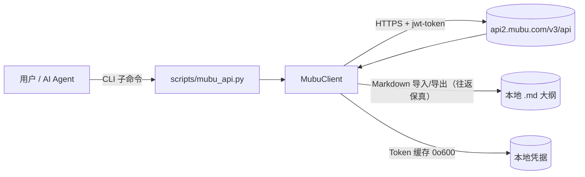
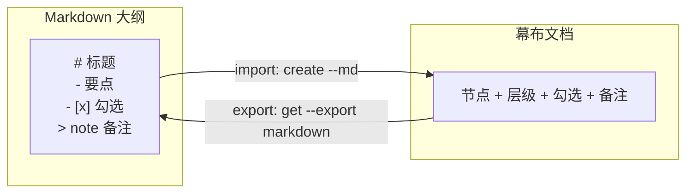

# mubu-integration

[](https://github.com/liuboacean/mubu-integration/stargazers)
[](https://github.com/liuboacean/mubu-integration/network/members)
[](https://opensource.org/licenses/MIT)
[](https://github.com/liuboacean/mubu-integration/actions/workflows/test.yml)

> Manage Mubu (幕布) outlines from the command line, with real Markdown round-trip.

> 一个 WorkBuddy Skill，通过命令行管理幕布（Mubu）文档与文件夹，并支持 Markdown 大纲的导入/导出（往返保真）。

幕布（Mubu）集成 Skill，支持通过命令行管理幕布文档和文件夹。

## 目录

- [✨ 为什么需要它](#为什么需要它)
- [特性亮点](#特性亮点)
- [架构与工作流程](#架构与工作流程)
- [第一步：配置凭据](#第一步配置凭据)
- [🚀 30 秒快速体验](#30-秒快速体验)
- [安装](#安装)
- [环境依赖](#环境依赖)
- [配置](#配置)
- [快速开始](#快速开始)
- [完整命令行参考](#完整命令行参考)
- [Agent 触发词](#agent-触发词)
- [测试与 CI](#测试与-ci)
- [常见问题 FAQ](#常见问题-faq)
- [注意事项](#注意事项)
- [License](#license)

## 项目结构（模块化）

代码按职责拆分为正式 Python 包，`scripts/mubu_api.py` 为向后兼容入口（shim）：

```
scripts/
├── mubu_api.py        # 向后兼容 shim：重新导出 mubu 包全部公开符号；python scripts/mubu_api.py 仍可用
└── mubu/              # 模块化包（v1.3.0 起）
    ├── __init__.py    # 包标识（__version__）
    ├── config.py      # 常量 / 配置 / 日志 / 异常 MubuError / 路径安全 / Token 锁
    ├── convert.py     # 文档 ↔ Markdown / OPML / FreeMind 转换 + 展示格式化
    ├── client.py      # MubuClient（鉴权 / 请求 / 文档·文件夹·搜索·整树导出）
    └── cli.py         # 命令行入口 main() + 日志配置
```

> `import mubu_api` 与 `from mubu.client import MubuClient` 等包内导入方式均可使用，对外接口零破坏。

## ✨ 为什么需要它

幕布是一款优秀的大纲 / 思维导图工具，但它在「自动化」和「AI 协作」上长期留白：

- 🧩 **没有官方 CLI / 开放 API** —— 想用脚本批量管理大纲、文档、文件夹？只能手动点。
- ✍️ **爱用 Markdown 写大纲** —— 习惯在编辑器里用 `#` / `-` 组织思路，却想同步进幕布？
- 🤖 **想让 AI Agent 直接操作幕布** —— 比如让 WorkBuddy 帮你整理周会纪要、自动归档资料。
- 🔁 **Markdown 导入/导出（往返保真）** —— 导出的 Markdown 再导回去，层级、勾选、备注结构一致。
> ⚠️ 当前为**往返保真**，**非**真正的双向同步：无 diff/merge，重复导入会生成新副本；真正的双向同步（true-sync）不在本期范围。

`mubu-integration` 用一行命令 + 一份 Markdown，把以上痛点一次解决：**真实 Markdown 导入/导出（往返保真），而非占位导出**。

## 特性亮点

### 核心功能

- 🔐 **登录认证** —— 手机号 + 密码登录，Token 本地缓存（文件权限 `0o600`）
- 📁 **文件夹管理** —— 创建、列表、删除、移动
- 📄 **文档管理** —— 创建、获取、保存、删除
- 📋 **大纲导出** —— 导出为 Markdown 格式（往返保真）

### 版本亮点（v1.2.0）

| 里程碑 | 能力 | 说明 |
| :--- | :--- | :--- |
| **M1 · P0** | 🔄 Markdown 导入/导出（往返保真） | 大纲 ↔ 幕布，含 `note` 备注、勾选 `[x]` 往返——**结构一致，不是占位** |
| **M1 · P0** | 🔁 自动重登 | Token 过期自动重新登录，401 仅重试 1 次，防死循环 |
| **M2 · P1** | 🛡️ 网络健壮性 | `timeout=15s` + 5xx/超时指数退避重试 2 次——**断网也不怕** |
| **M2 · P1** | 🔍 本地递归搜索 | `search` 按名称匹配、大小写不敏感，递归遍历全部子文件夹 |
| **M2 · P1** | 🔒 安全加固 | `.env.mubu` 加载（环境变量优先于文件）、Token 文件权限 `0o600` |
| **M3 · P2** | 🧪 工程化 | 全量类型注解、`requirements.txt`、CI 自动化测试（84 用例 × 4 Python 版本） |
| **M8 · 安全** | 🔐 凭据与路径安全 | `.env.mubu` 强制 `0o600`、移除明文参数改交互式 `getpass`、本地路径越界防护 `_safe_local_path`、API 域名白名单防 MITM |
| **M9 · P1** | 🔍 搜索截断 + 可观测 | `search()` 返回 `truncated` 标记与防环去重；标准 `logging`+敏感脱敏+`--verbose`；401/403/5xx/网络错误 stderr 指引；CI 钉死 action SHA + Dependabot |
| **P2 · 工程化** | ⚡ 性能与供应链 | `requests.Session` 连接复用（搜索多请求提速）、依赖拆分 `requirements.txt`+`requirements-dev.txt`、删除守卫（`--yes` 确认 + 回收站软删除） |

### 版本亮点（v1.3.0 · Roadmap）

| 里程碑 | 能力 | 说明 |
| :--- | :--- | :--- |
| **Roadmap · 整树导出** | 🌳 `export-tree` | 递归导出整个文件夹树为嵌套 `.md`（子文件夹→子目录），单点失败不阻断遍历 |
| **Roadmap · 重命名** | ✏️ `rename` | 文档走 `save_doc` name（round-trip 保内容）；文件夹走已验证端点 `/list/rename_folder`（`folderId` 填自身 id） |
| **Roadmap · 互操作** | 🔁 OPML / FreeMind | `opml <doc_id> --format opml\|freeplane` 导出为 OPML 2.0 / FreeMind XML，兼容 XMind 等大纲工具 |
| **Roadmap · 大重构** | 📦 模块拆分 | `scripts/mubu_api.py` 拆分为 `scripts/mubu/`（config/convert/client/cli），shim 向后兼容，`import mubu_api` 与 `from mubu.client import MubuClient` 均可用——**93 用例通过，接口零破坏** |

### 版本亮点（v1.3.5 · 软删除 / 回收站）

| 里程碑 | 能力 | 说明 |
| :--- | :--- | :--- |
| **v1.3.5** | 🗑️ 软删除 / 本地回收站 | `delete` 改为**软删除**：仅标记进本地回收站、云端副本仍在，`restore` 可恢复；`purge <id> --yes` 才是唯一不可逆操作（调用真实删除 API）；`trash` 列出已软删除项 |
| **v1.3.5** | 🔒 删除守卫强化 | `delete` / `purge` 均需显式 `--yes`；缺省打印回收站提示并 `exit 1`，绝不静默删除 |
| **v1.3.5** | 📦 供应链锁定 | 新增 `requirements.in` / `requirements-dev.in`，由 `pip-compile --generate-hashes` 生成**精确版本 + 哈希**锁文件（`requirements.txt` / `requirements-dev.txt`），CI 用 `pip-compile --check` 校验漂移 |
| **v1.3.5** | 🧪 测试扩展 | 新增 `TestTrash`（restore / purge / list&search 软删除过滤），**100 个 pytest 用例**全绿 |

## 架构与工作流程



Markdown 大纲与幕布文档的导入/导出（往返保真）示意：



## 第一步：配置凭据

> ⚠️ 使用本 Skill 的前提是已配置幕布账号凭据。若未配置，下面的命令会失败。
> 凭据**不会**出现在命令行参数里（避免泄露），请通过环境变量或 `~/.workbuddy/.env.mubu` 提供。

通过环境变量（推荐）：

```bash
export MUBU_PHONE="你的手机号"
export MUBU_PASSWORD="你的密码"
```

或写入仓库外的凭据文件 `~/.workbuddy/.env.mubu`（环境变量优先于文件，文件权限自动 `0o600`）：

```ini
MUBU_PHONE=你的手机号
MUBU_PASSWORD=你的密码
```

配置完成后即可继续下面的「30 秒快速体验」；也可用 `python3 scripts/mubu_api.py login` 交互式输入（缺失时自动提示）。

## 🚀 30 秒快速体验

写一段 Markdown 大纲，一键导入幕布；再导出来，结构、勾选、备注都一致。

```markdown
# 产品周会
- 上周进展
  - [x] 上线新版本
  - [ ] 修复登录 bug
- 本周计划
  - 性能优化
> 备注：记得同步给设计团队
```

```bash
# 1. 直接用仓库自带的示例大纲 examples/weekly.md（或把上面的内容保存为 weekly.md）
# 2. 一键导入幕布（自动转为大纲节点 + 勾选 + 备注）
python3 scripts/mubu_api.py create "产品周会" --folder <folder_id> --md examples/weekly.md

# 3. 再导出来 —— 层级、[x] 勾选、> note 备注都会原样还原
python3 scripts/mubu_api.py get <doc_id> --export markdown
```

## 安装

```bash
npx skills add liuboacean/mubu-integration
```

## 环境依赖

- 需要 **Python 3.9 及以上**版本。
- 安装 Python 依赖（**使用已锁定的 `requirements.txt` / `requirements-dev.txt`**，含精确版本与哈希，不要直接 `pip install requests`）：

```bash
# 运行时依赖（已精确锁定 + 哈希，见 requirements.txt）
pip install -r requirements.txt
# 开发/测试依赖（已锁定，见 requirements-dev.txt）
pip install -r requirements-dev.txt
```

`requirements.txt` 由 `pip-compile` 精确锁定（含哈希），仅含**运行时**依赖 `requests`；`pytest` / `responses` 等开发依赖拆分到 `requirements-dev.txt`。维护依赖请编辑 `requirements.in` / `requirements-dev.in` 后运行 `pip-compile --generate-hashes` 重新生成锁文件；CI 会校验锁文件与 `.in` 一致（注意：pip-tools 7.x 已移除 `pip-compile --check`，改用「重新生成并 diff」方式，见 `.github/workflows/test.yml`）。

## 配置

设置环境变量：

```bash
export MUBU_PHONE="你的手机号"
export MUBU_PASSWORD="你的密码"
```

或在 `~/.workbuddy/.env.mubu` 文件中配置（环境变量优先于文件）：

```ini
MUBU_PHONE=你的手机号
MUBU_PASSWORD=你的密码
```

## 快速开始

```bash
# 登录（首次使用需先配置凭据）
python3 scripts/mubu_api.py login

# 查看根目录
python3 scripts/mubu_api.py list

# 从 Markdown 创建文档
python3 scripts/mubu_api.py create "新文档" --folder <folder_id> --md examples/weekly.md

# 导出为 Markdown（往返保真，非占位）
python3 scripts/mubu_api.py get <doc_id> --export markdown
```

## 完整命令行参考

```bash
# 登录
python3 scripts/mubu_api.py login

# 获取根目录列表
python3 scripts/mubu_api.py list

# 获取子文件夹内容
python3 scripts/mubu_api.py list --folder <folder_id>

# 创建文件夹
python3 scripts/mubu_api.py mkdir "新文件夹"

# 创建文档
python3 scripts/mubu_api.py create "新文档" --folder <folder_id>

# 从 Markdown 文件导入创建文档
python3 scripts/mubu_api.py create "新文档" --folder <folder_id> --md examples/weekly.md

# 获取文档内容（JSON）
python3 scripts/mubu_api.py get <doc_id>

# 导出为 Markdown（往返保真，非占位）
python3 scripts/mubu_api.py get <doc_id> --export markdown

# 保存文档
python3 scripts/mubu_api.py save <doc_id> --content "内容"
python3 scripts/mubu_api.py save <doc_id> --file content.md

# 从 Markdown 文件导入更新文档
python3 scripts/mubu_api.py save <doc_id> --md outline.md

# 移动文档到其他文件夹
python3 scripts/mubu_api.py move <doc_id> --target <folder_id>

# 删除（软删除 → 本地回收站；执行前仍须确认目标 ID；必须显式 --yes；--type 默认 folder）
python3 scripts/mubu_api.py delete <id> --type folder --yes
python3 scripts/mubu_api.py delete <doc_id> --type doc --yes

# 按名称本地搜索文档/文件夹（递归遍历所有子文件夹，大小写不敏感）
python3 scripts/mubu_api.py search "项目"
python3 scripts/mubu_api.py search "项目" --json

# 递归导出整个文件夹树为嵌套 Markdown 文件（默认当前目录，--output 指定输出根）
python3 scripts/mubu_api.py export-tree --folder <root_folder_id> --output ./backup

# 重命名文档（走 save_doc 的 name 参数，round-trip 保内容）
python3 scripts/mubu_api.py rename <doc_id> --name "新标题" --type doc

# 重命名文件夹（已真机验证端点 /list/rename_folder，folderId 填自身 id）
python3 scripts/mubu_api.py rename <folder_id> --name "新文件夹名" --type folder

# 导出为 OPML 2.0 / FreeMind（兼容 XMind 等其它大纲工具）
python3 scripts/mubu_api.py opml <doc_id> --format opml
python3 scripts/mubu_api.py opml <doc_id> --format freeplane
```

## Agent 触发词

> 幕布、mubu、幕布大纲导入导出

当对话中出现以上关键词时，Skill 可被自动触发。

## 测试与 CI

本地运行全部测试（共 **100** 个 pytest 用例）：

```bash
PYTHONPATH=scripts python -m pytest -v
```

持续集成：在 push 到 `main` 分支或提交 Pull Request 时，GitHub Actions 会于 **Python 3.9 / 3.10 / 3.11 / 3.12** 矩阵中自动运行测试。100 个用例在四个 Python 版本上均真实执行（非假成功）。

## 常见问题 FAQ

**Q：需要有幕布账号吗？**
A：需要。使用你的手机号 + 密码登录（`MUBU_PHONE` / `MUBU_PASSWORD`）。这是幕布官方账号，本 Skill 不提供账号。

**Q：非官方接口，我的凭据安全吗？**
A：凭据仅本地存储——登录 Token 写入本地文件且权限为 `0o600`（仅本人可读写），不依赖任何第三方服务。环境变量优先于 `.env.mubu` 文件加载。详见 [注意事项](#注意事项)。

**Q：支持图片 / 附件节点吗？**
A：当前不支持。大纲折叠状态 `expand`、有序列表 `1.`、图片 / 附件节点不在本期 Markdown 导入/导出（往返保真）范围，详见 [已知限制](#注意事项)。

## 注意事项

基于幕布 Web API 逆向实现，**非官方接口**，可能随幕布版本更新而变化。

接口细节：所有请求发往 `https://api2.mubu.com/v3/api`，鉴权 JWT 通过请求头 `jwt-token` 传递。

### Token 刷新策略

- `access_token` 约 2 小时过期，临近过期自动重新登录（使用缓存凭据，不依赖 `refresh_token`）。
- 鉴权失败仅重试 1 次，避免密码错误 / 账号封禁时陷入死循环。
- `403` 权限不足等其它错误不触发重登。

### 已知限制

- 大纲折叠状态 `expand`、有序列表 `1.`、图片 / 附件节点不在本期 Markdown 导入/导出（往返保真）范围。
- 当前为 Markdown 导入/导出**往返保真**，**非**真正的双向同步（无 diff/merge，重复导入会生成新副本）；真正的双向同步（true-sync）不在本期范围。
- 多个顶层标题导入时，首个为根，其余作为根的子节点。
- `search` 为本地过滤：从根文件夹递归遍历所有子文件夹按名称匹配（大小写不敏感）。幕布无公开 `/search` 端点，故依赖本地遍历，文件夹极多时可能稍慢。

> 说明：v1.3.5 已包含 M1–M9 及 P2 全部能力，并新增软删除 / 本地回收站（`delete`→软删除、`restore` 恢复、`purge` 彻底删除、`trash` 列表），以上为功能边界而非未完成项。

## License

[MIT](https://opensource.org/licenses/MIT)
