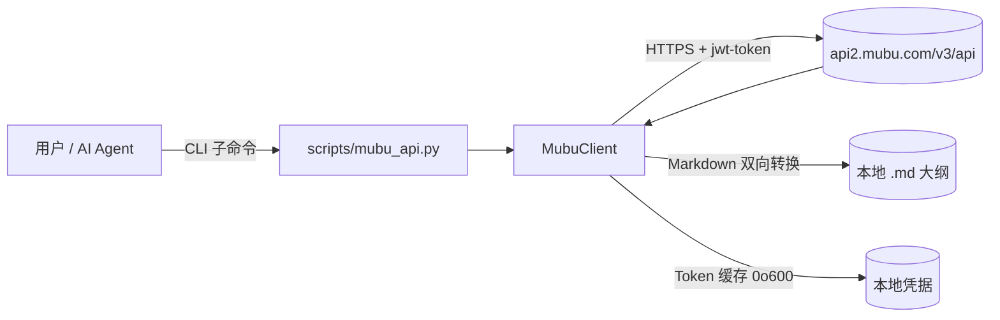
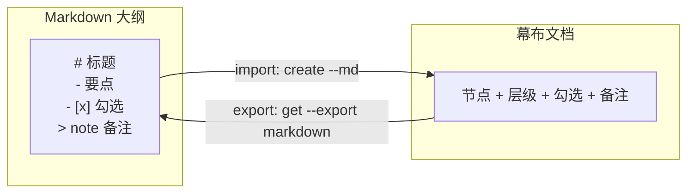

# mubu-integration

[](https://github.com/liuboacean/mubu-integration/stargazers)
[](https://github.com/liuboacean/mubu-integration/network/members)
[](https://opensource.org/licenses/MIT)
[](https://github.com/liuboacean/mubu-integration/actions/workflows/test.yml)

> Manage Mubu (幕布) outlines from the command line, with real Markdown round-trip.

> 一个 WorkBuddy Skill，通过命令行管理幕布（Mubu）文档与文件夹，并支持 Markdown 大纲的双向往返。

幕布（Mubu）集成 Skill，支持通过命令行管理幕布文档和文件夹。

## 目录

- [✨ 为什么需要它](#为什么需要它)
- [特性亮点](#特性亮点)
- [架构与工作流程](#架构与工作流程)
- [🚀 30 秒快速体验](#30-秒快速体验)
- [安装](#安装)
- [环境依赖](#环境依赖)
- [配置](#配置)
- [快速开始](#快速开始)
- [完整命令行参考](#完整命令行参考)
- [Agent 触发词](#agent-触发词)
- [测试与 CI](#测试与-ci)
- [常见问题 FAQ](#常见问题-faq)
- [注意事项](#注意事项)
- [License](#license)

## ✨ 为什么需要它

幕布是一款优秀的大纲 / 思维导图工具，但它在「自动化」和「AI 协作」上长期留白：

- 🧩 **没有官方 CLI / 开放 API** —— 想用脚本批量管理大纲、文档、文件夹？只能手动点。
- ✍️ **爱用 Markdown 写大纲** —— 习惯在编辑器里用 `#` / `-` 组织思路，却想同步进幕布？
- 🤖 **想让 AI Agent 直接操作幕布** —— 比如让 WorkBuddy 帮你整理周会纪要、自动归档资料。
- 🔁 **双向同步才是刚需** —— 导出的 Markdown 再导回去，结构、勾选、备注应当完全一致。

`mubu-integration` 用一行命令 + 一份 Markdown，把以上痛点一次解决：**真实双向往返，而非占位导出**。

## 特性亮点

### 核心功能

- 🔐 **登录认证** —— 手机号 + 密码登录，Token 本地缓存（文件权限 `0o600`）
- 📁 **文件夹管理** —— 创建、列表、删除、移动
- 📄 **文档管理** —— 创建、获取、保存、删除
- 📋 **大纲导出** —— 导出为 Markdown 格式（真实往返）

### 版本亮点（v1.0.0）

| 里程碑 | 能力 | 说明 |
| :--- | :--- | :--- |
| **M1 · P0** | 🔄 Markdown 双向往返 | 大纲 ↔ 幕布，含 `note` 备注、勾选 `[x]` 往返——**结构一致，不是占位** |
| **M1 · P0** | 🔁 自动重登 | Token 过期自动重新登录，401 仅重试 1 次，防死循环 |
| **M2 · P1** | 🛡️ 网络健壮性 | `timeout=15s` + 5xx/超时指数退避重试 2 次——**断网也不怕** |
| **M2 · P1** | 🔍 本地递归搜索 | `search` 按名称匹配、大小写不敏感，递归遍历全部子文件夹 |
| **M2 · P1** | 🔒 安全加固 | `.env.mubu` 加载（环境变量优先于文件）、Token 文件权限 `0o600` |
| **M3 · P2** | 🧪 工程化 | 全量类型注解、`requirements.txt`、CI 自动化测试（41 用例 × 4 Python 版本） |

## 架构与工作流程



Markdown 大纲与幕布文档的双向转换示意：



## 🚀 30 秒快速体验

写一段 Markdown 大纲，一键导入幕布；再导出来，结构、勾选、备注都一致。

```markdown
# 产品周会
- 上周进展
  - [x] 上线新版本
  - [ ] 修复登录 bug
- 本周计划
  - 性能优化
> 备注：记得同步给设计团队
```

```bash
# 1. 将上面的内容保存为 weekly.md
# 2. 一键导入幕布（自动转为大纲节点 + 勾选 + 备注）
python3 scripts/mubu_api.py create "产品周会" --folder <folder_id> --md weekly.md

# 3. 再导出来 —— 层级、[x] 勾选、> note 备注都会原样还原
python3 scripts/mubu_api.py get <doc_id> --export markdown
```

## 安装

```bash
npx skills add liuboacean/mubu-integration
```

## 环境依赖

- 需要 **Python 3.9 及以上**版本。
- 安装 Python 依赖：

```bash
pip install -r requirements.txt
```

`requirements.txt` 包含：

- `requests` —— HTTP 请求
- `pytest` —— 单元测试
- `responses` —— 网络请求 Mock

## 配置

设置环境变量：

```bash
export MUBU_PHONE="你的手机号"
export MUBU_PASSWORD="你的密码"
```

或在 `~/.workbuddy/.env.mubu` 文件中配置（环境变量优先于文件）：

```ini
MUBU_PHONE=你的手机号
MUBU_PASSWORD=你的密码
```

## 快速开始

```bash
# 登录（首次使用需先配置凭据）
python3 scripts/mubu_api.py login

# 查看根目录
python3 scripts/mubu_api.py list

# 从 Markdown 创建文档
python3 scripts/mubu_api.py create "新文档" --folder <folder_id> --md outline.md

# 导出为 Markdown（真实往返，非占位）
python3 scripts/mubu_api.py get <doc_id> --export markdown
```

## 完整命令行参考

```bash
# 登录
python3 scripts/mubu_api.py login

# 获取根目录列表
python3 scripts/mubu_api.py list

# 获取子文件夹内容
python3 scripts/mubu_api.py list --folder <folder_id>

# 创建文件夹
python3 scripts/mubu_api.py mkdir "新文件夹"

# 创建文档
python3 scripts/mubu_api.py create "新文档" --folder <folder_id>

# 从 Markdown 文件导入创建文档
python3 scripts/mubu_api.py create "新文档" --folder <folder_id> --md outline.md

# 获取文档内容（JSON）
python3 scripts/mubu_api.py get <doc_id>

# 导出为 Markdown（真实往返，非占位）
python3 scripts/mubu_api.py get <doc_id> --export markdown

# 保存文档
python3 scripts/mubu_api.py save <doc_id> --content "内容"
python3 scripts/mubu_api.py save <doc_id> --file content.md

# 从 Markdown 文件导入更新文档
python3 scripts/mubu_api.py save <doc_id> --md outline.md

# 移动文档到其他文件夹
python3 scripts/mubu_api.py move <doc_id> --target <folder_id>

# 删除
python3 scripts/mubu_api.py delete <id>

# 按名称本地搜索文档/文件夹（递归遍历所有子文件夹，大小写不敏感）
python3 scripts/mubu_api.py search "项目"
python3 scripts/mubu_api.py search "项目" --json
```

## Agent 触发词

> 幕布、mubu、大纲笔记、思维导图导出、幕布同步

当对话中出现以上关键词时，Skill 可被自动触发。

## 测试与 CI

本地运行全部测试（共 **41** 个 pytest 用例）：

```bash
PYTHONPATH=scripts python -m pytest -v
```

持续集成：在 push 到 `main` 分支或提交 Pull Request 时，GitHub Actions 会于 **Python 3.9 / 3.10 / 3.11 / 3.12** 矩阵中自动运行测试。41 个用例在四个 Python 版本上均真实执行（非假成功）。

## 常见问题 FAQ

**Q：需要有幕布账号吗？**
A：需要。使用你的手机号 + 密码登录（`MUBU_PHONE` / `MUBU_PASSWORD`）。这是幕布官方账号，本 Skill 不提供账号。

**Q：非官方接口，我的凭据安全吗？**
A：凭据仅本地存储——登录 Token 写入本地文件且权限为 `0o600`（仅本人可读写），不依赖任何第三方服务。环境变量优先于 `.env.mubu` 文件加载。详见 [注意事项](#注意事项)。

**Q：支持图片 / 附件节点吗？**
A：当前不支持。大纲折叠状态 `expand`、有序列表 `1.`、图片 / 附件节点不在本期 Markdown 往返范围，详见 [已知限制](#注意事项)。

## 注意事项

基于幕布 Web API 逆向实现，**非官方接口**，可能随幕布版本更新而变化。

接口细节：所有请求发往 `https://api2.mubu.com/v3/api`，鉴权 JWT 通过请求头 `jwt-token` 传递。

### Token 刷新策略

- `access_token` 约 2 小时过期，临近过期自动重新登录（使用缓存凭据，不依赖 `refresh_token`）。
- 鉴权失败仅重试 1 次，避免密码错误 / 账号封禁时陷入死循环。
- `403` 权限不足等其它错误不触发重登。

### 已知限制

- 大纲折叠状态 `expand`、有序列表 `1.`、图片 / 附件节点不在本期 Markdown 往返范围。
- 多个顶层标题导入时，首个为根，其余作为根的子节点。
- `search` 为本地过滤：从根文件夹递归遍历所有子文件夹按名称匹配（大小写不敏感）。幕布无公开 `/search` 端点，故依赖本地遍历，文件夹极多时可能稍慢。

> 说明：v1.0.0 已包含 M1 / M2 / M3 全部能力，以上为功能边界而非未完成项。

## License

[MIT](https://opensource.org/licenses/MIT)
