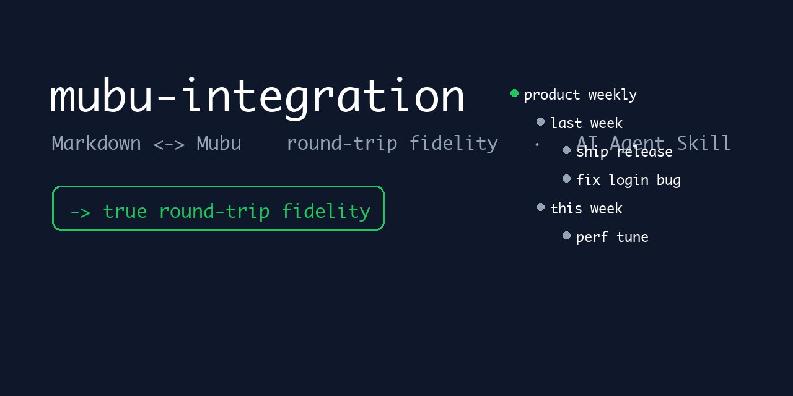
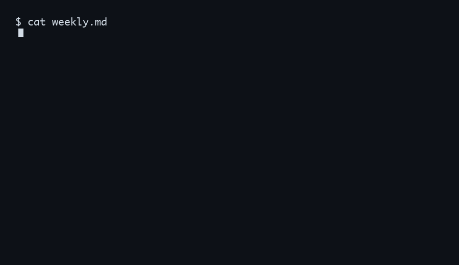
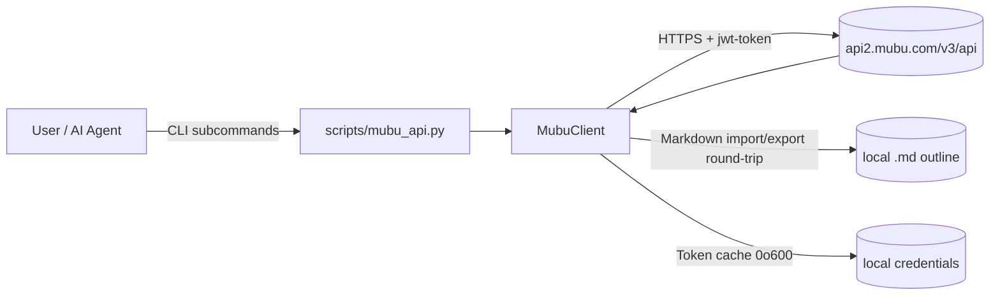
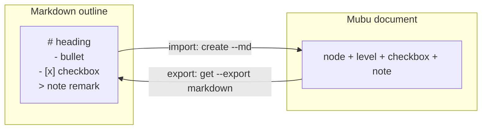

[English](README.md) | [中文](README.zh-CN.md)



# mubu-integration

> Turn Mubu (幕布) into a Markdown-native, AI-agent-controllable outliner.

[](https://github.com/liuboacean/mubu-integration/stargazers)
[](https://github.com/liuboacean/mubu-integration/network/members)
[](https://opensource.org/licenses/MIT)
[](https://github.com/liuboacean/mubu-integration/actions/workflows/test.yml)

Manage your Mubu (幕布) outlines from the command line — **and as an AI Agent Skill** — with lossless Markdown import/export round-trip.

---

## ✨ Try it in 3 commands (magic moment)

```bash
python3 scripts/mubu_api.py create --md weekly.md                    # Markdown outline → Mubu
python3 scripts/mubu_api.py get <doc-id> --export markdown > out.md  # Mubu → Markdown
diff weekly.md out.md                                              # no output = byte-for-byte identical
```



---

## 🆚 Why mubu-integration?

| Capability | Manual copy | Existing export-plugin scripts | **mubu-integration** |
| :--- | :---: | :---: | :---: |
| Mubu → Markdown | ✅ | ⚠️ partial | ✅ |
| Markdown → Mubu | ❌ | ❌ | ✅ **(only)** |
| Round-trip fidelity (`diff` = no diff) | ❌ | ❌ | ✅ **(only)** |
| Whole-tree batch / OPML / FreeMind | ❌ | ⚠️ some | ✅ |
| Callable by an AI Agent | ❌ | ❌ | ✅ **(only)** |
| Scriptable from the command line | ❌ | ⚠️ | ✅ |

---

## 💡 Use cases

**① Let your AI Agent read & write Mubu directly** — turn Mubu into your Agent's long-term, structured memory.

```bash
python3 scripts/mubu_api.py get <doc-id> --export markdown > memory.md   # Agent pulls the latest outline
# ... Agent edits memory.md ...
python3 scripts/mubu_api.py save <doc-id> --md memory.md                 # writes the updated outline back to Mubu
```

**② Obsidian ↔ Mubu, two-way outlines** — keep your knowledge base and your outliner in sync as plain Markdown.

```bash
python3 scripts/mubu_api.py get <doc-id> --export markdown > vault/notes/mubu.md   # Mubu → Obsidian
python3 scripts/mubu_api.py create --md vault/notes/mubu.md --folder <folder-id>   # Obsidian → Mubu
```

**③ Auto-archive weekly meeting notes** — push `examples/weekly.md` into Mubu in one step.

```bash
python3 scripts/mubu_api.py create "周会" --folder <folder-id> --md examples/weekly.md
```

---

## 🚀 30-second quick start

1. Set your Mubu credentials (phone + password). They are never passed as CLI arguments — use env vars or a local file:

   ```bash
   export MUBU_PHONE="your-phone"
   export MUBU_PASSWORD="your-password"
   ```

   …or write them to `~/.workbuddy/.env.mubu` (env vars take precedence; the file is auto-chmod `0o600`):

   ```ini
   MUBU_PHONE=your-phone
   MUBU_PASSWORD=your-password
   ```

2. Grab the bundled sample outline (`examples/weekly.md`):

   ```markdown
   # 产品周会
   - 上周进展
     - [x] 上线新版本
     - [ ] 修复登录 bug
   - 本周计划
     - 性能优化
   > 备注：记得同步给设计团队
   ```

3. Import it, then export it back — headings, `[x]` checkboxes and `> note` remarks all survive intact:

   ```bash
   python3 scripts/mubu_api.py create "产品周会" --folder <folder_id> --md examples/weekly.md
   python3 scripts/mubu_api.py get <doc_id> --export markdown
   ```

---

## 📦 Install

```bash
npx skills add liuboacean/mubu-integration
```

This installs the Skill for your agent. It is a Python package — you also need **Python 3.9+** and the runtime dependency:

```bash
pip install -r requirements.txt
```

Dev/test dependencies live in `requirements-dev.txt` (`pip install -r requirements-dev.txt`).

---

## 🛡️ Reliability

mubu-integration talks to the **same HTTPS endpoints the Mubu web app uses** — no scraping, no browser automation.

- ✅ **Verified against the live service** — last real-device check on **2026-08-05** against mubu.com's production environment. `move`, `save_doc`, `rename`, OPML, FreeMind and `export-tree` are all confirmed working.
- ✅ **84 tests × 4 Python versions, always green** — the GitHub Actions matrix runs Python 3.9 / 3.10 / 3.11 / 3.12 on every push and PR.
- ✅ **Zero-touch auth** — expired tokens re-login automatically using your cached credentials; no manual intervention.
- ✅ **Pinned supply chain** — `requirements.txt` locks exact versions; Dependabot keeps them current automatically.
- ✅ **Your data stays yours** — the tool only ever accesses the account you log into, with your own credentials. Credentials are stored locally at `~/.mubu_token` with `0o600` permissions (readable only by you).

<details>
<summary>Technical notes</summary>

mubu-integration is an **unofficial** integration that uses the same endpoints as the Mubu web client. All requests go to `https://api2.mubu.com/v3/api`; auth is a JWT passed via the `jwt-token` header. The `access_token` expires in ~2 hours and is refreshed automatically (one retry only, to avoid lockout loops); `403` and other errors do not trigger re-login.

**Known limits:** outline collapse state (`expand`), ordered lists (`1.`), and image/attachment nodes are not part of the current Markdown round-trip. Round-trip is lossless but not a live two-way sync (no diff/merge) — re-importing creates a new copy.

</details>

---

## ⚙️ How it works


```mermaid
flowchart LR
    U[User / AI Agent] -->|CLI subcommands| CLI[scripts/mubu_api.py]
    CLI --> Client[MubuClient]
    Client -->|HTTPS + jwt-token| API[(api2.mubu.com/v3/api)]
    API --> Client
    Client -->|Markdown import/export round-trip| MD[(local .md outline)]
    Client -->|Token cache 0o600| Cache[(local credentials)]
```

Markdown outline ⇄ Mubu document (round-trip):


```mermaid
flowchart LR
    subgraph MD[Markdown outline]
        M["# heading<br>- bullet<br>- [x] checkbox<br>&gt; note remark"]
    end
    subgraph MU[Mubu document]
        B["node + level + checkbox + note"]
    end
    M -->|import: create --md| B
    B -->|export: get --export markdown| M
```

**Project structure** (modular Python package; `scripts/mubu_api.py` is a backward-compatible shim):

```
scripts/
├── mubu_api.py        # backward-compatible shim (re-exports the mubu package)
└── mubu/              # modular package (v1.3.0+)
    ├── __init__.py    # package identity (__version__)
    ├── config.py      # constants / config / logging / MubuError / path safety / token lock
    ├── convert.py     # doc ↔ Markdown / OPML / FreeMind conversion + display formatting
    ├── client.py      # MubuClient (auth / requests / doc·folder·search·tree export)
    └── cli.py         # CLI entrypoint main() + logging setup
```

---

## 📚 CLI reference

<details>
<summary>Show all 20+ commands</summary>

```bash
# Login (first use requires credentials configured)
python3 scripts/mubu_api.py login

# List root directory
python3 scripts/mubu_api.py list

# List a sub-folder
python3 scripts/mubu_api.py list --folder <folder_id>

# Create a folder
python3 scripts/mubu_api.py mkdir "New Folder"

# Create a document
python3 scripts/mubu_api.py create "New Doc" --folder <folder_id>

# Create a document from a Markdown file
python3 scripts/mubu_api.py create "New Doc" --folder <folder_id> --md examples/weekly.md

# Get document content (JSON)
python3 scripts/mubu_api.py get <doc_id>

# Export as Markdown (round-trip, not a placeholder)
python3 scripts/mubu_api.py get <doc_id> --export markdown

# Save document
python3 scripts/mubu_api.py save <doc_id> --content "content"
python3 scripts/mubu_api.py save <doc_id> --file content.md

# Update a document from a Markdown file
python3 scripts/mubu_api.py save <doc_id> --md outline.md

# Move a document to another folder
python3 scripts/mubu_api.py move <doc_id> --target <folder_id>

# Delete (⚠️ irreversible — confirm the ID; requires explicit --yes; --type defaults to folder)
python3 scripts/mubu_api.py delete <id> --type folder --yes
python3 scripts/mubu_api.py delete <doc_id> --type doc --yes

# Local search by name (recursive across all sub-folders, case-insensitive)
python3 scripts/mubu_api.py search "project"
python3 scripts/mubu_api.py search "project" --json

# Recursively export a whole folder tree as nested Markdown (default: cwd; --output sets root)
python3 scripts/mubu_api.py export-tree --folder <root_folder_id> --output ./backup

# Rename a document (save_doc name; round-trip preserves content)
python3 scripts/mubu_api.py rename <doc_id> --name "New Title" --type doc

# Rename a folder (verified endpoint /list/rename_folder; folderId = its own id)
python3 scripts/mubu_api.py rename <folder_id> --name "New Folder Name" --type folder

# Export as OPML 2.0 / FreeMind (compatible with XMind and other outliners)
python3 scripts/mubu_api.py opml <doc_id> --format opml
python3 scripts/mubu_api.py opml <doc_id> --format freeplane
```

</details>

---

## 🤖 Agent trigger words

> 幕布、mubu、幕布大纲导入导出

When these keywords appear in a conversation, the Skill can be triggered automatically.

---

## 🧪 Tests & CI

Run the full suite locally (**84** pytest cases):

```bash
PYTHONPATH=scripts python -m pytest -v
```

Continuous integration: on every push to `main` and on every Pull Request, GitHub Actions runs the **84** cases across the **Python 3.9 / 3.10 / 3.11 / 3.12** matrix — all executed for real, not faked green.

---

## ❓ FAQ

**Q: Do I need a Mubu account?**
A: Yes. Log in with your phone + password (`MUBU_PHONE` / `MUBU_PASSWORD`). This is your official Mubu account; the Skill does not provide one.

**Q: It's an unofficial integration — are my credentials safe?**
A: Credentials are stored only locally. The login token is written to a local file with `0o600` permissions (you-only read/write) and uses no third-party service. Env vars take precedence over the `.env.mubu` file. See [Reliability](#-reliability).

**Q: Are image / attachment nodes supported?**
A: Not yet. Outline collapse state (`expand`), ordered lists (`1.`), and image/attachment nodes are outside the current Markdown round-trip. See the [technical notes](#-reliability) for the full list of known limits.

---

## 📄 License

[MIT](https://opensource.org/licenses/MIT)
