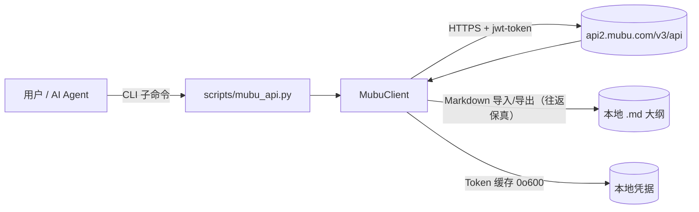
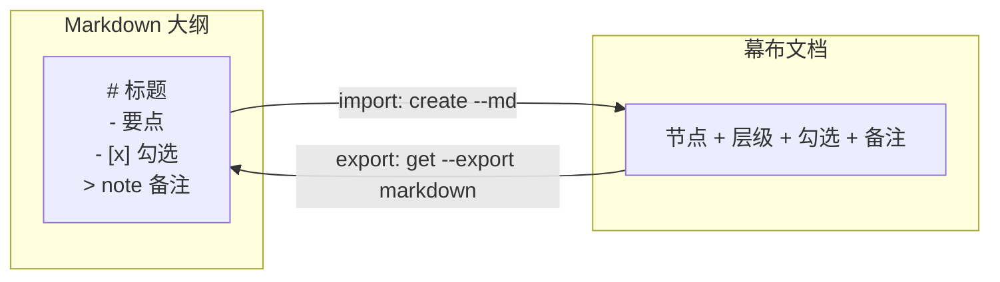

[English](README.md) | [中文](README.zh-CN.md)


# mubu-integration

> 把幕布变成 Markdown 原生、可被 AI Agent 操控的大纲工具。

[](https://github.com/liuboacean/mubu-integration/stargazers)
[](https://github.com/liuboacean/mubu-integration/network/members)
[](https://opensource.org/licenses/MIT)
[](https://github.com/liuboacean/mubu-integration/actions/workflows/test.yml)

通过命令行管理你的幕布（Mubu）大纲 —— **同时作为一个 AI Agent Skill** —— 支持 Markdown 导入/导出的无损往返保真。

---

## ✨ 三条命令上手（magic moment）

```bash
python3 scripts/mubu_api.py create --md weekly.md                    # Markdown 大纲 → 幕布
python3 scripts/mubu_api.py get <doc-id> --export markdown > out.md  # 幕布 → Markdown
diff weekly.md out.md                                              # 无输出 = 一字不差
```


---

## 🆚 为什么选 mubu-integration？

| 能力 | 手动复制 | 现有导出插件脚本 | **mubu-integration** |
| :--- | :---: | :---: | :---: |
| 幕布 → Markdown | ✅ | ⚠️ 部分 | ✅ |
| Markdown → 幕布 | ❌ | ❌ | ✅ **（唯一）** |
| 往返保真（diff 无差异） | ❌ | ❌ | ✅ **（唯一）** |
| 整树批量 / OPML / FreeMind | ❌ | ⚠️ 部分 | ✅ |
| 可被 AI Agent 调用 | ❌ | ❌ | ✅ **（唯一）** |
| 命令行可脚本化 | ❌ | ⚠️ | ✅ |

---

## 💡 使用场景

**① 让 AI Agent 直接读写你的幕布** —— 把幕布变成 Agent 的长期结构化记忆。

```bash
python3 scripts/mubu_api.py get <doc-id> --export markdown > memory.md   # Agent 拉取最新大纲
# ... Agent 编辑 memory.md ...
python3 scripts/mubu_api.py save <doc-id> --md memory.md                 # 把更新后的大纲写回幕布
```

**② Obsidian ↔ 幕布 双向大纲** —— 以纯 Markdown 让你的知识库和大纲工具保持同步。

```bash
python3 scripts/mubu_api.py get <doc-id> --export markdown > vault/notes/mubu.md   # 幕布 → Obsidian
python3 scripts/mubu_api.py create --md vault/notes/mubu.md --folder <folder-id>   # Obsidian → 幕布
```

**③ 周会纪要自动归档** —— 一步把 `examples/weekly.md` 推入幕布。

```bash
python3 scripts/mubu_api.py create "周会" --folder <folder-id> --md examples/weekly.md
```

---

## 🚀 30 秒快速体验

1. 配置幕布凭据（手机号 + 密码）。凭据**不会**作为命令行参数传递 —— 用环境变量或本地文件：

   ```bash
   export MUBU_PHONE="你的手机号"
   export MUBU_PASSWORD="你的密码"
   ```

   …或写入仓库外的 `~/.workbuddy/.env.mubu`（环境变量优先；文件权限自动 `0o600`）：

   ```ini
   MUBU_PHONE=你的手机号
   MUBU_PASSWORD=你的密码
   ```

2. 使用自带的示例大纲（`examples/weekly.md`）：

   ```markdown
   # 产品周会
   - 上周进展
     - [x] 上线新版本
     - [ ] 修复登录 bug
   - 本周计划
     - 性能优化
   > 备注：记得同步给设计团队
   ```

3. 导入后再导出来 —— 标题层级、`[x]` 勾选、`> note` 备注都会原样还原：

   ```bash
   python3 scripts/mubu_api.py create "产品周会" --folder <folder_id> --md examples/weekly.md
   python3 scripts/mubu_api.py get <doc_id> --export markdown
   ```

---

## 📦 安装

```bash
npx skills add liuboacean/mubu-integration
```

这会为你的 Agent 安装该 Skill。它是一个 Python 包 —— 你还需要 **Python 3.9+** 及运行时依赖：

```bash
pip install -r requirements.txt
```

开发与测试依赖在 `requirements-dev.txt`（`pip install -r requirements-dev.txt`）。

---

## 🛡️ 可靠性

mubu-integration 调用的是**与幕布 Web 端相同的 HTTPS 接口** —— 不爬取、不操控浏览器。

- ✅ **已对线上环境真机验证** —— 最近一次真机校验为 **2026-08-05**，针对 mubu.com 生产环境。`move`、`save_doc`、`rename`、OPML、FreeMind、`export-tree` 均已确认可用。
- ✅ **84 用例 × 4 个 Python 版本，每次全绿** —— GitHub Actions 矩阵在每次 push 和 PR 时于 Python 3.9 / 3.10 / 3.11 / 3.12 上运行。
- ✅ **零人工介入鉴权** —— Token 过期后用缓存凭据自动重新登录，无需手动干预。
- ✅ **依赖全量锁定** —— `requirements.txt` 锁定精确版本；Dependabot 自动跟进更新。
- ✅ **数据边界清晰** —— 工具仅以你的凭据访问你自己账号下的数据。凭据仅本地存储于 `~/.mubu_token`，权限 `0o600`（仅本人可读写）。

<details>
<summary>技术细节</summary>

mubu-integration 是一个**非官方**集成，使用的接口与幕布 Web 端一致。所有请求发往 `https://api2.mubu.com/v3/api`；鉴权 JWT 通过请求头 `jwt-token` 传递。`access_token` 约 2 小时过期并自动刷新（仅重试 1 次，避免锁定死循环）；`403` 及其它错误不触发重新登录。

**已知限制：** 大纲折叠状态 `expand`、有序列表 `1.`、图片 / 附件节点不在当前 Markdown 往返保真范围。往返保真但非实时双向同步（无 diff/merge），重复导入会生成新副本。

</details>

---

## ⚙️ 工作原理



Markdown 大纲 ⇄ 幕布文档（往返保真）示意：



**项目结构**（模块化 Python 包；`scripts/mubu_api.py` 为向后兼容 shim）：

```
scripts/
├── mubu_api.py        # 向后兼容 shim（重新导出 mubu 包）
└── mubu/              # 模块化包（v1.3.0+）
    ├── __init__.py    # 包标识（__version__）
    ├── config.py      # 常量 / 配置 / 日志 / MubuError / 路径安全 / Token 锁
    ├── convert.py     # 文档 ↔ Markdown / OPML / FreeMind 转换 + 展示格式化
    ├── client.py      # MubuClient（鉴权 / 请求 / 文档·文件夹·搜索·整树导出）
    └── cli.py         # 命令行入口 main() + 日志配置
```

---

## 📚 命令行参考

<details>
<summary>展开全部 20+ 命令</summary>

```bash
# 登录（首次使用需先配置凭据）
python3 scripts/mubu_api.py login

# 获取根目录列表
python3 scripts/mubu_api.py list

# 获取子文件夹内容
python3 scripts/mubu_api.py list --folder <folder_id>

# 创建文件夹
python3 scripts/mubu_api.py mkdir "新文件夹"

# 创建文档
python3 scripts/mubu_api.py create "新文档" --folder <folder_id>

# 从 Markdown 文件导入创建文档
python3 scripts/mubu_api.py create "新文档" --folder <folder_id> --md examples/weekly.md

# 获取文档内容（JSON）
python3 scripts/mubu_api.py get <doc_id>

# 导出为 Markdown（往返保真，非占位）
python3 scripts/mubu_api.py get <doc_id> --export markdown

# 保存文档
python3 scripts/mubu_api.py save <doc_id> --content "内容"
python3 scripts/mubu_api.py save <doc_id> --file content.md

# 从 Markdown 文件导入更新文档
python3 scripts/mubu_api.py save <doc_id> --md outline.md

# 移动文档到其他文件夹
python3 scripts/mubu_api.py move <doc_id> --target <folder_id>

# 删除（⚠️ 不可逆，执行前务必确认目标 ID；必须显式 --yes；--type 默认 folder）
python3 scripts/mubu_api.py delete <id> --type folder --yes
python3 scripts/mubu_api.py delete <doc_id> --type doc --yes

# 按名称本地搜索文档/文件夹（递归遍历所有子文件夹，大小写不敏感）
python3 scripts/mubu_api.py search "项目"
python3 scripts/mubu_api.py search "项目" --json

# 递归导出整个文件夹树为嵌套 Markdown 文件（默认当前目录，--output 指定输出根）
python3 scripts/mubu_api.py export-tree --folder <root_folder_id> --output ./backup

# 重命名文档（走 save_doc 的 name 参数，round-trip 保内容）
python3 scripts/mubu_api.py rename <doc_id> --name "新标题" --type doc

# 重命名文件夹（已真机验证端点 /list/rename_folder，folderId 填自身 id）
python3 scripts/mubu_api.py rename <folder_id> --name "新文件夹名" --type folder

# 导出为 OPML 2.0 / FreeMind（兼容 XMind 等其它大纲工具）
python3 scripts/mubu_api.py opml <doc_id> --format opml
python3 scripts/mubu_api.py opml <doc_id> --format freeplane
```

</details>

---

## 🤖 Agent 触发词

> 幕布、mubu、幕布大纲导入导出

当对话中出现以上关键词时，Skill 可被自动触发。

---

## 🧪 测试与 CI

本地运行全部测试（共 **84** 个 pytest 用例）：

```bash
PYTHONPATH=scripts python -m pytest -v
```

持续集成：在 push 到 `main` 分支或提交 Pull Request 时，GitHub Actions 会于 **Python 3.9 / 3.10 / 3.11 / 3.12** 矩阵中自动运行测试。84 个用例在四个 Python 版本上均真实执行（非假成功）。

---

## ❓ 常见问题 FAQ

**Q：需要有幕布账号吗？**
A：需要。使用你的手机号 + 密码登录（`MUBU_PHONE` / `MUBU_PASSWORD`）。这是幕布官方账号，本 Skill 不提供账号。

**Q：这是非官方集成，我的凭据安全吗？**
A：凭据仅本地存储——登录 Token 写入本地文件且权限为 `0o600`（仅本人可读写），不依赖任何第三方服务。环境变量优先于 `.env.mubu` 文件加载。详见[可靠性](#-可靠性)。

**Q：支持图片 / 附件节点吗？**
A：当前不支持。大纲折叠状态 `expand`、有序列表 `1.`、图片 / 附件节点不在当前 Markdown 往返保真范围。完整已知限制见[技术细节](#-可靠性)。

---

## 📄 License

[MIT](https://opensource.org/licenses/MIT)
